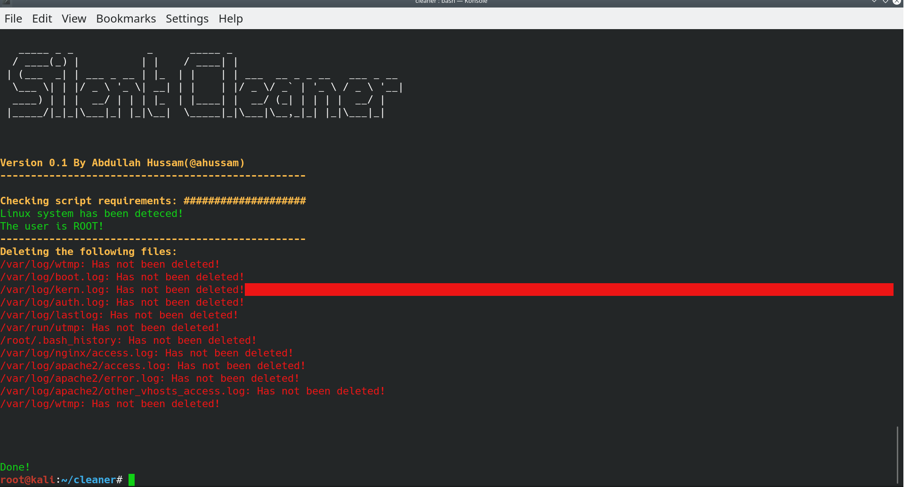

# Silent Cleaner

A bash script to remove all of the logs files and shred them. 



### Prerequisites

* Root user on the system 

### Usage 

```
root@linux:~# git clone https://github.com/ahussam/silent-cleaner.git
root@linux:~# cd silent-cleaner 
root@linux:~/silent-cleaner# chmod 777 silentCleaner.sh	
root@linux:~/silent-cleaner# vim silentCleaner.sh	# Uncomment lines no 119 & 124 
root@linux:~/silent-cleaner# bash silentCleaner.sh
```

### Legal Disclaimer

* You are responsible for your own actions. If you mess something up or break any laws while using this software, it's your fault, and your fault only. The author is not responsible for the tool usage. 


